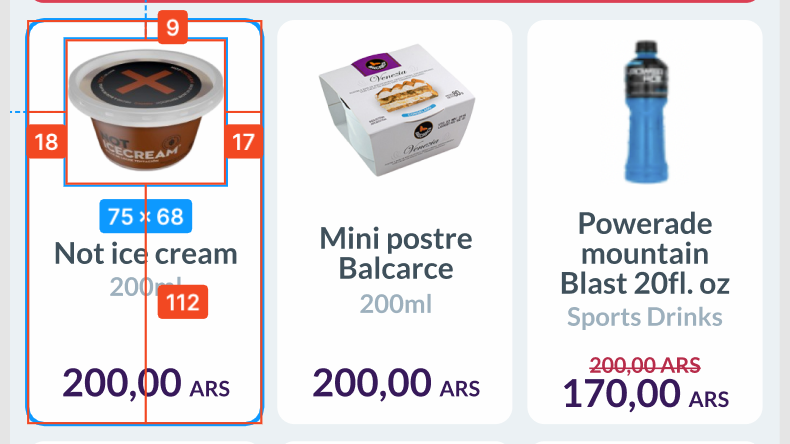

# frontend-test

Completar los siguientes ejercicios, subirlos a su cuenta de github y enviarnos el link.

## Ejercicio 1

Crear un dashboard con [https://nextjs.org/] donde puedo manejar los destinos de viajes.

Tengo que poder listar, crear y modificar los destinos.

###
 Reglas

1 - Como usuario al entrar al dashboard la pagina de inicio me lista todos los desitnos de vacaciones que existen. ( Si no hayresultados tiene que motrar un mensaje que diga que no se encontraron destinos  )

2 - Como usuario quiero tener un boton "Crear" que me lleve a un formulario donde puedo crear un destino (Los campos necesarios son los que estan en el body del endpoint POST)

3 - Como usuario quiero poder hacer click en un destino de vaciones en particular y me lleve a un formulario precargado con los datos y poder editarlo.

4 - Al crear o editar tiene que volver a la pagina inicial donde se muestra el listado de los destinos de vacaciones.


### Levantar el backend en local

`npm i`

`npm run db`


### Country endpoint

http://localhost:3000/countries


### Location endpoint

http://localhost:3000/locations

Body:
```
{
  "id": 4,
  "countryId":3,
  "name":"Methuen Town",
  "latitude":"-86.7487",
  "longitude":"-148.9767"
}
```

Buscar con filtros
http://localhost:3000/locations?name_like=Methuen

Obtener por id
http://localhost:3000/locations/4


## Ejercicio 2 

Crear en un html el siguiente maquetado (no es necesario que se haga en nextjs)
Las medidas que salen como referencia estan en px.



